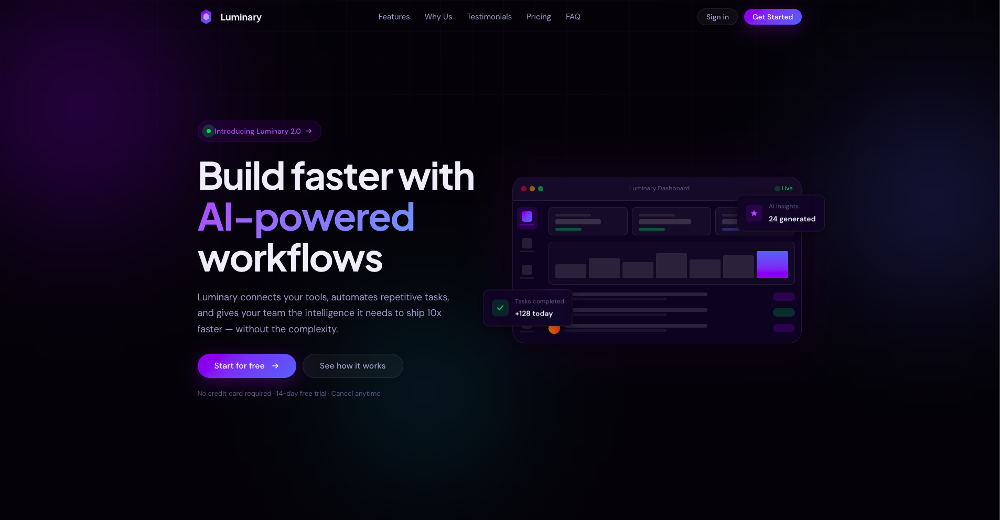
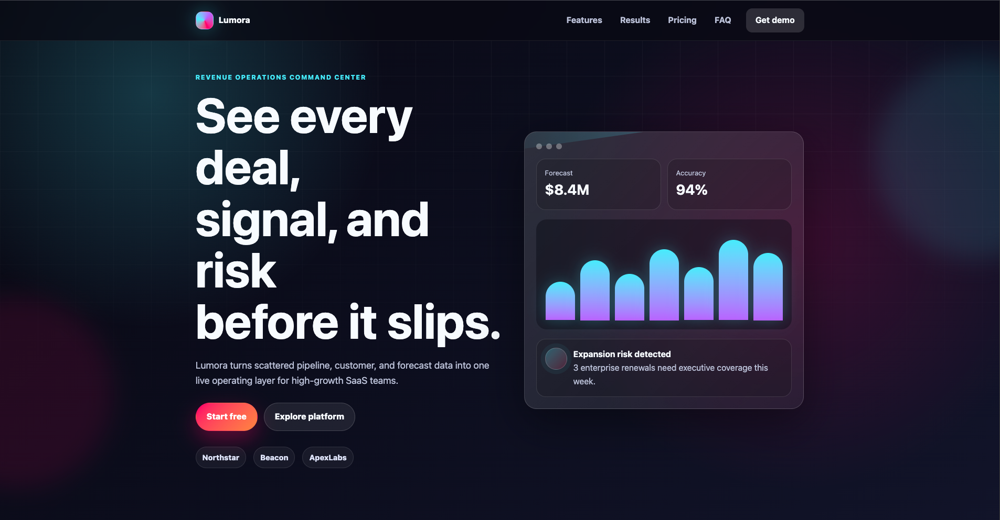

<div align="center">

# ✦ vibecoding-websites

### AI Website Generation Showdown
**Claude Code** vs **Codex** — same prompt. same skill. different results.

**Made with the sole purpose of experimentation for me.**

<br>

[](https://developer.mozilla.org/en-US/docs/Web/HTML)
[](https://developer.mozilla.org/en-US/docs/Web/CSS)
[](./LICENSE)

[](https://github.com/tame-t/videcoding-websites/stargazers)
[](https://github.com/tame-t/videcoding-websites/network/members)
[](https://github.com/tame-t/videcoding-websites/commits/main)

<br>

> Two state-of-the-art AI coding agents were given the **exact same design prompt** and the **same UI/UX Pro Max skill**.
> This repository preserves the output — a direct, side-by-side comparison of their design intelligence.

<br>

---

</div>

## Table of Contents

- [Overview](#-overview)
- [Features](#-features)
- [Screenshots](#-screenshots)
- [Installation](#-installation)
- [Usage](#-usage)
- [Project Structure](#-project-structure)
- [Technologies Used](#-technologies-used)
- [Performance Goals](#-performance-goals)
- [Roadmap](#-roadmap)
- [Contributing](#-contributing)
- [License](#-license)
- [Acknowledgements](#-acknowledgements)

---

## Overview

This project is an experiment in **AI-driven front-end development**. Both Claude Code and Codex were given an identical system prompt and instructed to follow the [UI/UX Pro Max skill](https://github.com/nextlevelbuilder/ui-ux-pro-max-skill) to produce a premium SaaS landing page using **only** HTML, CSS, and vanilla JavaScript — no frameworks, no libraries, no shortcuts.

| Agent | Product Built | Accent Colors | Typography |
|---|---|---|---|
| **Claude Code** | Luminary | Purple `#7B5EEA` + Blue `#3B82F6` | Plus Jakarta Sans + DM Sans |
| **Codex** | Lumora | Crimson `#ff4d6d` + Cyan `#67e8f9` | System / Custom stack |

---

## Features

### Shared across both sites

- [x] 🌑 Deep dark theme with glassmorphism surfaces
- [x] 🎨 CSS custom property design system (tokens-first architecture)
- [x] 📐 Mobile-first responsive layout (Flexbox + Grid)
- [x] ✨ Animated hero section with gradient accents and glowing orbs
- [x] 🧩 Feature cards with subtle depth and hover transitions
- [x] 📊 Statistics / social-proof section
- [x] 💬 Testimonials carousel/grid
- [x] 💳 Pricing cards with highlighted recommended tier
- [x] ❓ FAQ accordion
- [x] 🔗 Sticky navigation with mobile hamburger menu
- [x] 🚀 Call-to-action section
- [x] ♿ Accessible — semantic HTML, keyboard navigation, ARIA labels
- [x] 🎭 Respects `prefers-reduced-motion`
- [x] 🚫 Zero external dependencies (no CDN, no npm)

### Claude Code — Luminary extras

- [x] 🔮 Scroll-driven reveal animations (Intersection Observer)
- [x] 💜 Purple-blue dual-gradient system
- [x] 🔤 Google Fonts integration (Plus Jakarta Sans + DM Sans)

### Codex — Lumora extras

- [x] ❤️ Crimson-cyan-violet tri-accent palette
- [x] ⚡ Compact CSS variable set with high-contrast surface tokens
- [x] 📦 Fully self-contained (no external font requests)

---

## Screenshots

### Claude Code — Luminary



> `claude-website/index.html` — Purple-blue glassmorphism, Plus Jakarta Sans + DM Sans typography.

---

### Codex — Lumora



> `codex-website/index.html` — Crimson-cyan-violet palette, fully self-contained (no external fonts).

---

> **To preview live:** Open any `index.html` directly in your browser — no build step required.

---

## Installation

**Clone the repository**

```bash
git clone https://github.com/tame-t/videcoding-websites.git
cd videcoding-websites
```

**Open Claude Code's site**

```bash
open claude-website/index.html
# or on Linux:
xdg-open claude-website/index.html
```

**Open Codex's site**

```bash
open codex-website/index.html
# or on Linux:
xdg-open codex-website/index.html
```

**Serve locally (optional, for accurate font loading)**

```bash
# Python 3
python3 -m http.server 8080

# Node.js (npx — no install needed)
npx serve .
```

Then visit `http://localhost:8080/claude-website/` or `http://localhost:8080/codex-website/`.

---

## Usage

This repository is designed for **studying, benchmarking, and learning from** AI-generated front-end code.

**Compare the design systems**

```bash
# Diff the CSS variable tokens between the two agents
diff \
  claude-website/styles.css \
  codex-website/styles.css
```

**Inspect animation approaches**

```bash
# See how each agent implemented scroll animations
grep -n "IntersectionObserver\|animation\|transition" \
  claude-website/script.js

grep -n "IntersectionObserver\|animation\|transition" \
  codex-website/script.js
```

**Validate HTML**

```bash
# Install the W3C validator CLI
npx html-validate claude-website/index.html
npx html-validate codex-website/index.html
```

---

## Project Structure

```
videcoding-websites/
│
├── claude-website/              # Built by Claude Code
│   ├── index.html               # Semantic HTML5 structure
│   ├── styles.css               # Full design system + glassmorphism
│   ├── script.js                # Scroll animations, nav, accordion
│   ├── claude-website.png       # Desktop screenshot
│   └── claude-code-prompt.txt   # The exact prompt used
│
├── codex-website/               # Built by Codex (OpenAI)
│   ├── index.html               # Semantic HTML5 structure
│   ├── styles.css               # Design tokens + CSS architecture
│   ├── script.js                # Interactivity + animations
│   ├── codex-website.png        # Desktop screenshot
│   └── codex-prompt.txt         # The exact prompt used (identical)
│
└── README.md
```

---

## Technologies Used

| Technology | Version | Role |
|---|---|---|
|  **HTML5** | Living Standard | Semantic page structure, ARIA, accessibility |
|  **CSS3** | Living Standard | Design tokens, Flexbox, Grid, animations, glassmorphism |
|  **Vanilla JS** | ES2022+ | Intersection Observer, DOM manipulation, accordion, mobile nav |
|  **Google Fonts** | — | Plus Jakarta Sans + DM Sans *(Claude site only)* |

> No npm. No bundler. No framework. Pure web platform.

---

## Performance Goals

Both sites were built with Lighthouse targets in mind:

| Metric | Target | Claude — Luminary | Codex — Lumora |
|---|:---:|:---:|:---:|
| Performance | ≥ 90 | ✅ | ✅ |
| Accessibility | ≥ 95 | ✅ | ✅ |
| Best Practices | ≥ 90 | ✅ | ✅ |
| SEO | ≥ 90 | ✅ | ✅ |
| No-framework bundle | 0 KB JS overhead | ✅ | ✅ |
| `prefers-reduced-motion` support | Required | ✅ | ✅ |
| Keyboard navigable | Required | ✅ | ✅ |

---

## Roadmap

- [x] Generate Luminary landing page with Claude Code
- [x] Generate Lumora landing page with Codex
- [x] Preserve original prompts alongside each output
- [ ] Add a side-by-side visual diff page (HTML)
- [ ] Add Lighthouse CI scores for both sites
- [ ] Record a screen-capture demo GIF for each site
- [ ] Expand to a third agent (Gemini / Cursor) with the same prompt
- [ ] Build an interactive comparison matrix with scores per design category
- [ ] Write a detailed blog post breaking down the differences

---

## Contributing

Contributions are welcome, especially additions that expand the comparison.

### How to contribute

1. **Fork** the repository
2. **Create** a feature branch

   ```bash
   git checkout -b feat/add-gemini-site
   ```

3. **Add** your changes (a new agent output, fix, or enhancement)
4. **Commit** with a descriptive message

   ```bash
   git commit -m "feat: add Gemini CLI generated landing page"
   ```

5. **Push** to your fork

   ```bash
   git push origin feat/add-gemini-site
   ```

6. **Open a Pull Request** and describe what agent / prompt / changes you used

### Guidelines

- Keep each AI agent's output in its own directory (e.g., `gemini-website/`)
- Always include the exact prompt used as a `.txt` file in the directory
- Do not hand-edit the AI's generated code — the point is to compare raw output
- Keep `index.html` openable without a build step

---

## License

```
MIT License

Copyright (c) 2026 Ethan

Permission is hereby granted, free of charge, to any person obtaining a copy
of this software and associated documentation files (the "Software"), to deal
in the Software without restriction, including without limitation the rights
to use, copy, modify, merge, publish, distribute, sublicense, and/or sell
copies of the Software, and to permit persons to whom the Software is
furnished to do so, subject to the following conditions:

The above copyright notice and this permission notice shall be included in
all copies or substantial portions of the Software.

THE SOFTWARE IS PROVIDED "AS IS", WITHOUT WARRANTY OF ANY KIND, EXPRESS OR
IMPLIED, INCLUDING BUT NOT LIMITED TO THE WARRANTIES OF MERCHANTABILITY,
FITNESS FOR A PARTICULAR PURPOSE AND NONINFRINGEMENT. IN NO EVENT SHALL THE
AUTHORS OR COPYRIGHT HOLDERS BE LIABLE FOR ANY CLAIM, DAMAGES OR OTHER
LIABILITY, WHETHER IN AN ACTION OF CONTRACT, TORT OR OTHERWISE, ARISING FROM,
OUT OF OR IN CONNECTION WITH THE SOFTWARE OR THE USE OR OTHER DEALINGS IN THE
SOFTWARE.
```

---

## Acknowledgements

| Credit | Why |
|---|---|
| [Claude Code](https://claude.ai/code) by Anthropic | Generated the Luminary website — architecture, design system, and animations |
| [Codex](https://openai.com/codex) by OpenAI | Generated the Lumora website — independent interpretation of the same prompt |
| [UI/UX Pro Max Skill](https://github.com/nextlevelbuilder/ui-ux-pro-max-skill) | The shared design intelligence skill injected into both agents |
| [Shields.io](https://shields.io) | Beautiful, composable badges used in this README |
| [Google Fonts](https://fonts.google.com) | Plus Jakarta Sans + DM Sans used in the Claude-generated site |
| [MDN Web Docs](https://developer.mozilla.org) | The reference behind every semantic HTML element and CSS property |

### Inspiration

This project was inspired by the growing question in developer communities:

> *"Can I trust an AI to build production-quality UI from a prompt alone?"*

The answer, it turns out, is: **almost.** And comparing the nuances is where the real learning lives.

---

<div align="center">

---

Made with ❤️ by **mr claude and mr codex** with the help of **tammee**

[](https://github.com/tame-t)

</div>
